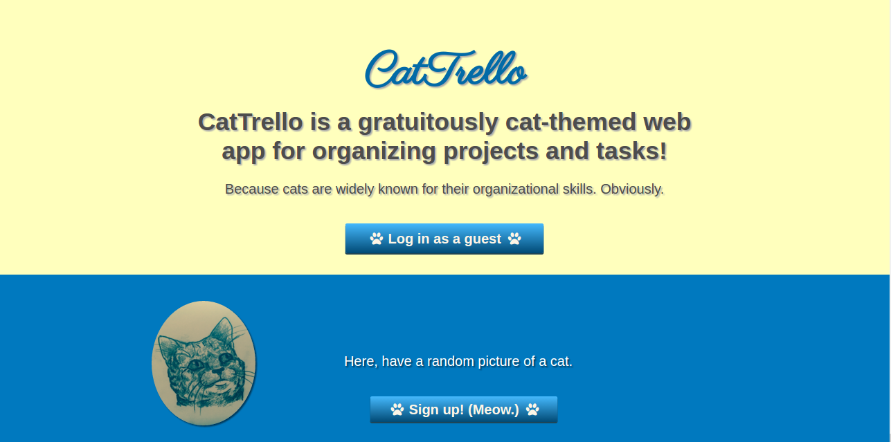
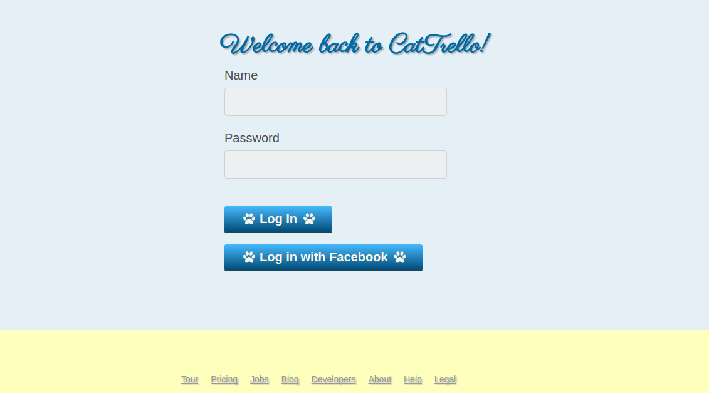
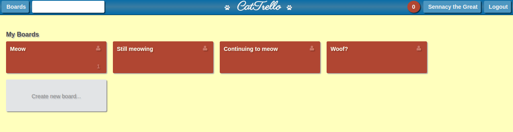
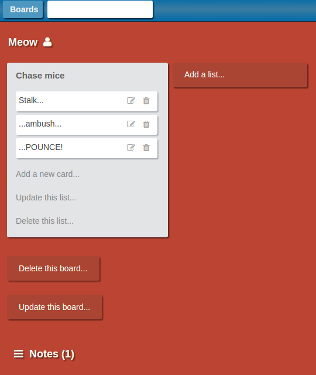
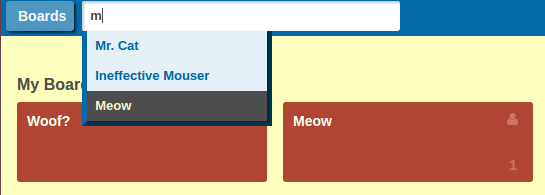
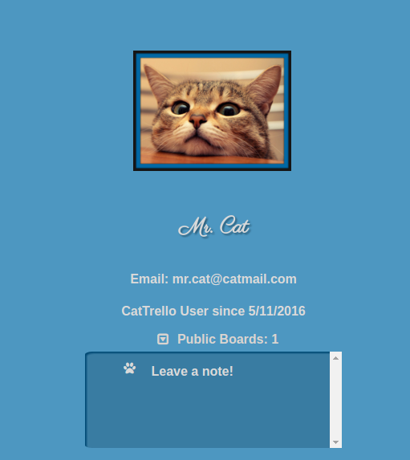
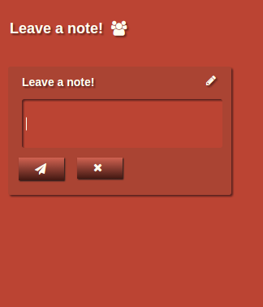
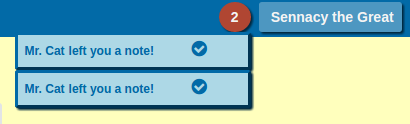
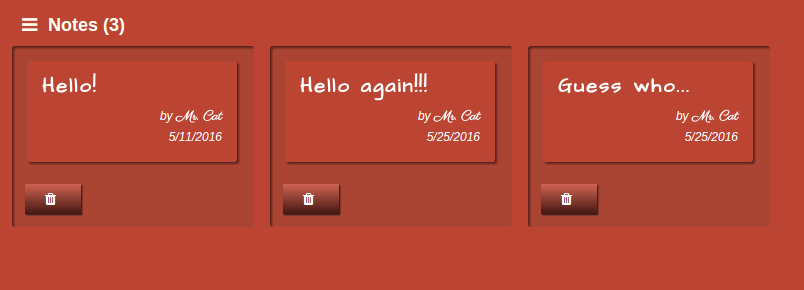

##Welcome to CatTrello!
CatTrello is a web application inspired by Trello, and built using Ruby on Rails and React.js.

www.cattrello.press

To sample CatTrello's functionality, just sign in as a guest!

###Selected Features:

* Create account.
* Sign up with Facebook.

* Create/read/update/delete boards, lists, and cards.

* Search for boards and users.

* View users' profile pages.
* View other users' public boards.
* Leave notes on other users' boards.

* Receive notifications about new notes.
* View and delete notes.

In future, CatTrello users will also be able to:

* Create teams.
