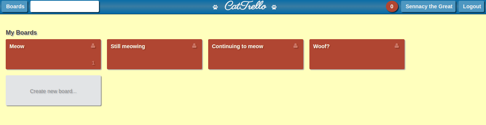
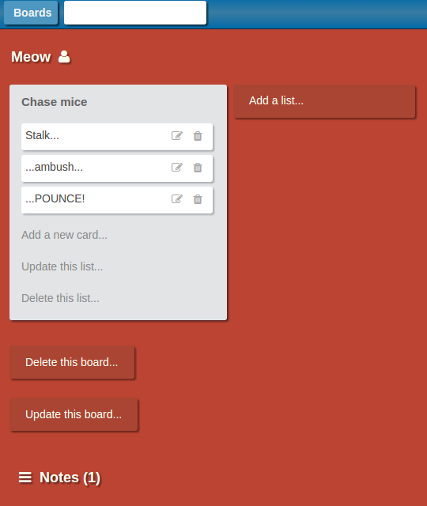
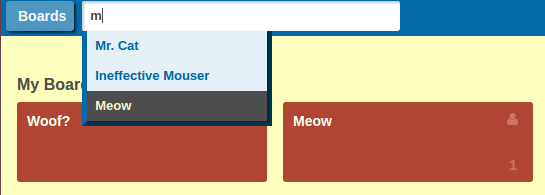
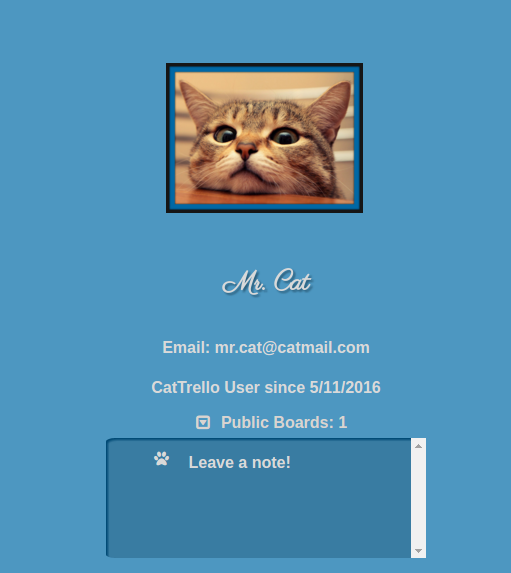
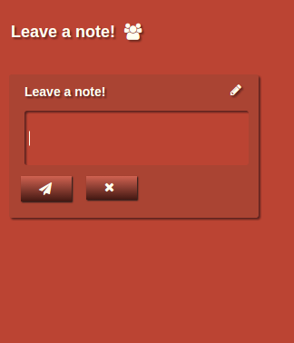
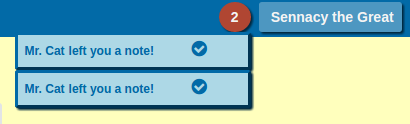
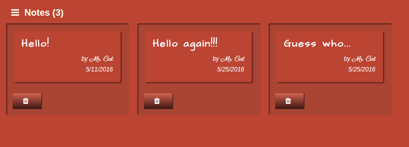
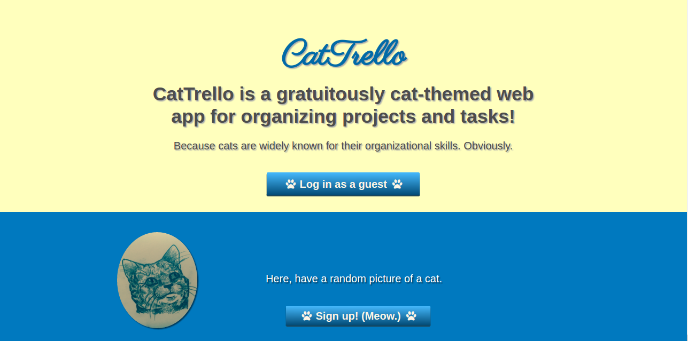
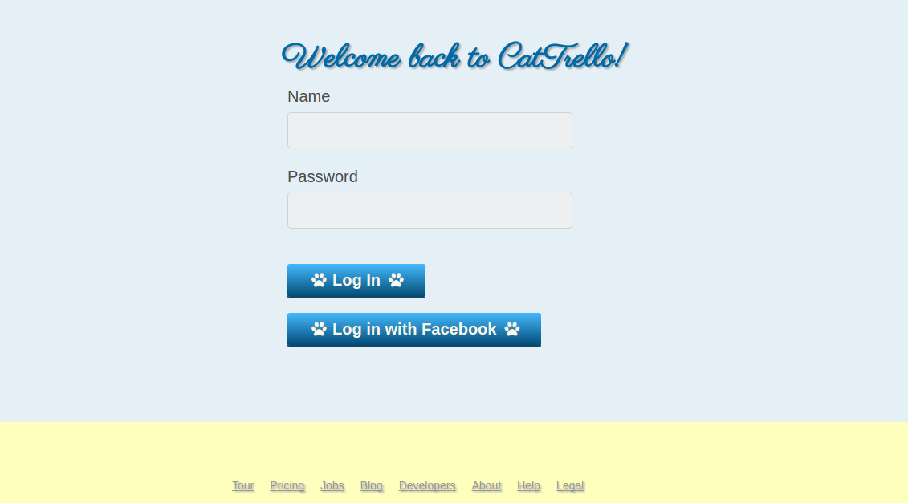

##Welcome to CatTrello!
<a href="http://www.cattrello.press">CatTrello</a> is a web application inspired by Trello, and built using Ruby on Rails and React.js.

www.cattrello.press

To sample CatTrello's functionality, just sign in as a guest!

###Languages and Technologies:

* Ruby on Rails
* Postgres
* OmniAuth
* Bcrypt
* PgSearch
* JSON
* AJAX
* JavaScript
* React.js
* Flux
* HTML5
* CSS3

###Selected Features:

* Create/read/update/delete boards, lists, and cards.

* Search for boards and users.

* View users' profile pages.
* View other users' public boards.
* Leave notes on other users' boards.

--w

* Receive notifications about new notes.
* View and delete notes.

* Create account.
* Sign up with Facebook.

