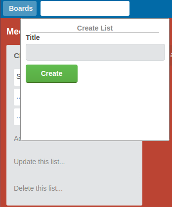

##README
CatTrello is a web application inspired by Trello, and built using Ruby on Rails and React.js.

www.cattrello.press

To sample CatTrello's functionality, just sign in as a guest!

###Features:

* Log in/out.
* Create account.
* Sign up with Facebook.

* View all existing boards (board index).
* View all lists and cards for any given board (board detail page).

* Create, update, and delete boards.
* Create, update, and delete lists.
* Create, update, and delete cards.

* Search for boards.
* Search for users.
* View users' profile pages.
* View other users' public boards.

* Leave notes on other users' boards.
* View and delete notes from other users.
* Receive notifications about new notes.

In future, CatTrello users will also be able to:

* Create teams.

